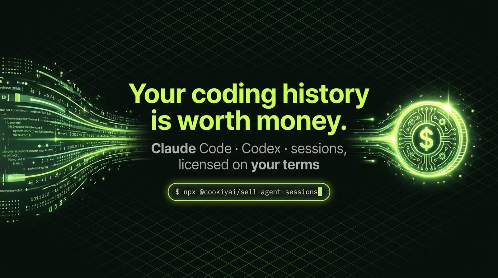
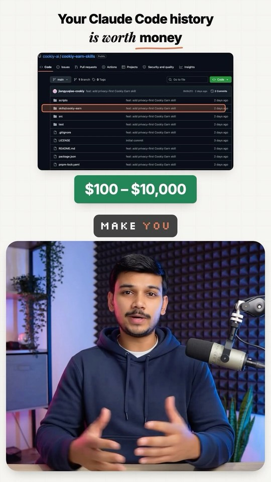
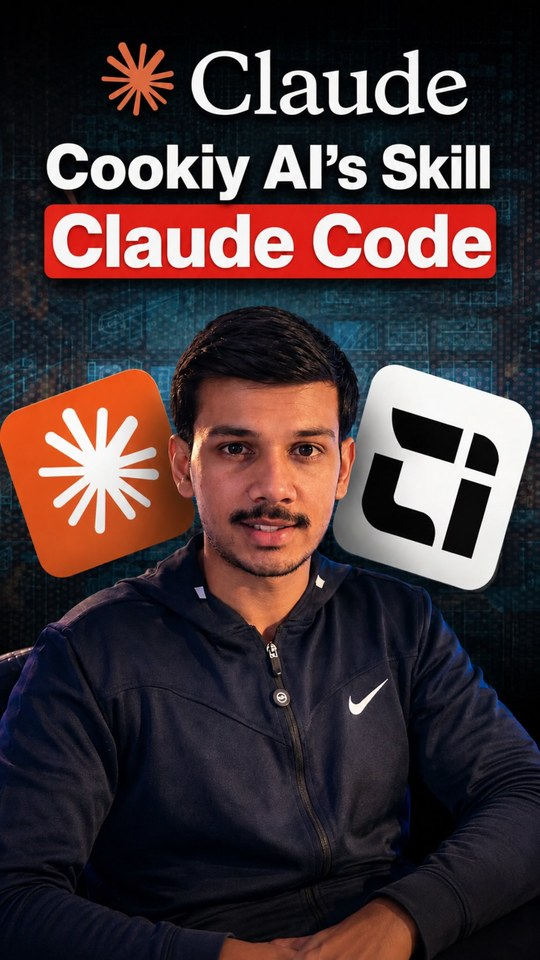
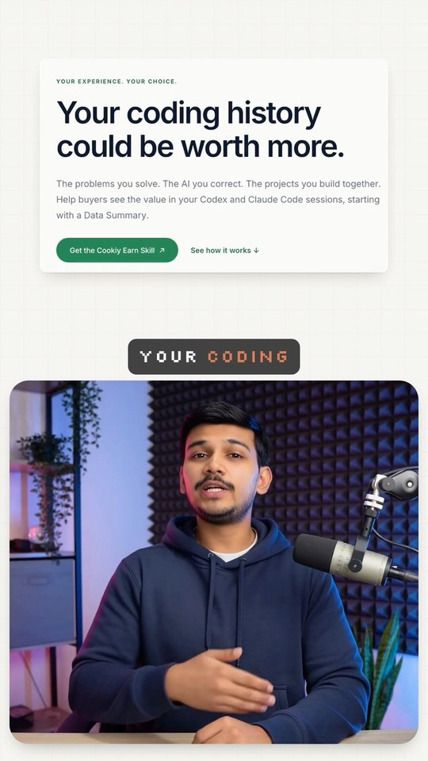
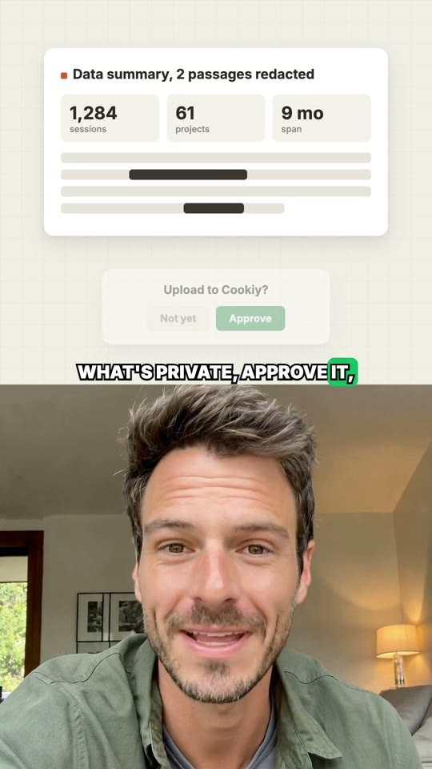
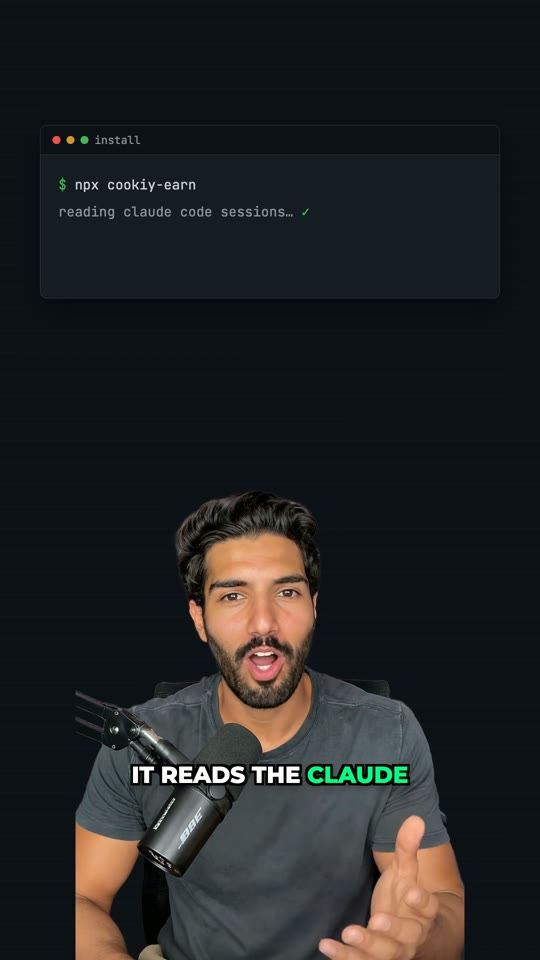
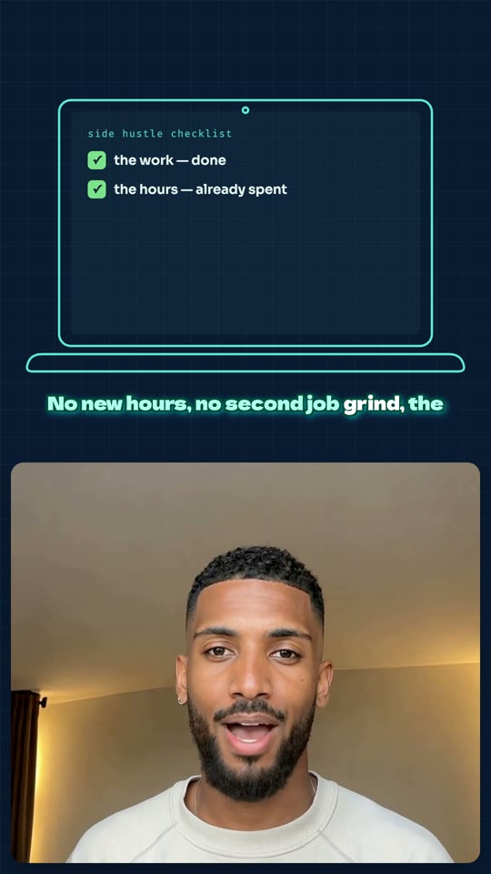
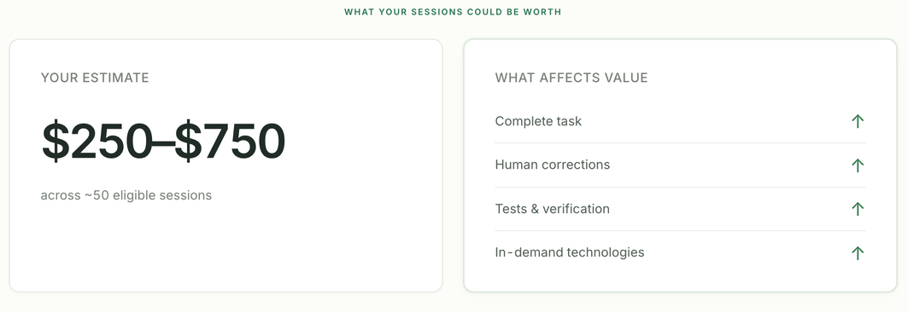

<!-- Part of the Cookiy sell-sessions skill · https://github.com/cookiy-ai/sell-sessions-skill -->

<p align="center">
  
</p>

<h1 align="center">Your coding history is worth money.</h1>

<p align="center">
  <b>Sell your Claude Code and Codex sessions to AI labs. One command. Runs locally. You approve every upload.</b>
</p>

<p align="center">
  <a href="https://github.com/cookiy-ai/sell-sessions-skill/stargazers"></a>
  <a href="https://www.npmjs.com/package/@cookiyai/sell-agent-sessions"></a>
  <a href="LICENSE"></a>
</p>

<p align="center">
  <a href="https://earn.cookiy.ai/sell-sessions"><b>earn.cookiy.ai</b></a> ·
  <a href="#get-started-in-2-minutes">Get started</a> ·
  <a href="#what-you-are-actually-selling">What you're selling</a> ·
  <a href="#you-stay-in-control">Privacy</a> ·
  <a href="#faq">FAQ</a>
</p>

<br>

## The pitch, in one paragraph

You pay for Claude Code. Anthropic's terms let them use your interactions to improve their models. That's why the models got so good at coding, and why the pricing stays high. Your sessions are already training data. The only question is whether **you** get paid for them. Cookiy Earn lets you pick the sessions you're willing to license, scrubs secrets and PII on your laptop, prices each one, and pays you every time a buyer licenses it. More labs with good coding data means cheaper models for everyone, including you.

<br>

## Get started in 2 minutes

```bash
npx @cookiyai/sell-agent-sessions
```

A local web app opens at `localhost:4318`. It scans your agent history, groups sessions by project, and shows an estimated value per license. Nothing is uploaded until you tick sessions and hit **Upload**.

<p align="center">
  
</p>

Prefer to let your agent do it? Install the skill and say *"I want to sell my agent sessions"*:

```bash
npx skills add cookiy-ai/sell-sessions-skill --global
```

<br>

## 150K+ views in the first week 🎬

<table>
  <tr>
    <td width="33%" align="center">
      <a href="https://www.instagram.com/rishiexplainsai/reel/Dc_QiLkKmmv/"></a><br>
      <sub><b>@rishiexplainsai</b><br>82.4K views · 320 likes · 246 comments</sub>
    </td>
    <td width="33%" align="center">
      <a href="https://www.instagram.com/rishiexplainsai/reel/Dc1YN1nKC95/"></a><br>
      <sub><b>@rishiexplainsai</b><br>69K views · 1.3K likes · 363 comments</sub>
    </td>
    <td width="33%" align="center">
      <a href="https://www.instagram.com/rishiexplainsai/reel/DdCMWb2KRuu/"></a><br>
      <sub><b>@rishiexplainsai</b><br>5K+ views · posted this week</sub>
    </td>
  </tr>
</table>

<table>
  <tr>
    <td width="25%" align="center"><br><sub>"My Claude Code subscription costs more than my gym. The sessions can pay it back."</sub></td>
    <td width="25%" align="center"><br><sub>"The valuable piece isn't the code. It's the corrections."</sub></td>
    <td width="25%" align="center"><br><sub>"I run infrastructure for a living. No daemons, no phone-home. Only what you approve gets sent."</sub></td>
    <td width="25%" align="center"><br><sub>"The only side hustle where you start out already done."</sub></td>
  </tr>
</table>

<p align="center"><sub>Batch 1 of the creator program: 20 videos, September 2026. 200 more in production.</sub></p>

<br>

## What you are actually selling

Not code. **Judgment.** A session where you planned the task, caught the model's mistake, overrode it, ran the tests and shipped is a complete, labeled trajectory of how real engineering gets done. That's the scarce part, and it's what labs pay for.

| Signal | Effect on value |
|---|---|
| Task completed, working outcome | ↑↑ |
| Human corrections and overrides | ↑↑ |
| Tests, verification, CI runs | ↑ |
| In-demand stacks and infra | ↑ |
| Short, abandoned, or trivial sessions | ↓ |

<p align="center">
  
</p>

<sub>Estimates appear in the uploader before you upload anything. They are not offers. Final prices are set on sale and depend on quality, difficulty, completeness, model, tokens and buyer demand. The same session can be licensed to more than one buyer and pays out each time.</sub>

<br>

## You stay in control

| | |
|---|---|
| 🖥️ **Runs on your machine** | The uploader is a local web app. Your history never leaves your laptop until you select and confirm. |
| 🧹 **Scrubbed before upload** | Secrets, keys and PII are detected and redacted locally. You can review before confirming. |
| ☑️ **Opt in per session** | Tick exactly what you want to license. Untouched sessions are never read past the local scan. |
| 🚫 **Nothing on install** | Installing or opening the uploader uploads zero bytes. |
| 🔍 **Open source** | The skill is MIT licensed. The uploader ships as a plain npm package you can inspect. |
| ⚠️ **No false promises** | Automated redaction is not perfect. Review your uploads. We never guarantee a sale or a price. |

<br>

## How it works

<p align="center">
  
</p>

1. **Choose.** The uploader finds sessions in `~/.claude`, `~/.codex` and platform equivalents and lists them by project.
2. **Scrub and price.** Local redaction, then an estimated value per session.
3. **Earn.** Cookiy licenses your sessions to buyers and pays you on every completed sale.

<br>

## Install

<details open>
<summary><b>Run the uploader directly</b> (Node.js + npm)</summary>

```bash
npx @cookiyai/sell-agent-sessions
```
</details>

<details>
<summary><b>Install the skill into Claude Code / Codex / Cursor</b></summary>

```bash
npx skills add cookiy-ai/sell-sessions-skill --global
```

Then: *"I want to sell my agent sessions to earn income."* The skill explains the product, installs the uploader on your host OS (not in a sandbox) and keeps it running after the conversation ends.
</details>

<details>
<summary><b>Or just paste this into your agent</b></summary>

> Follow https://github.com/cookiy-ai/sell-sessions-skill to install the skill and start the local session uploader for me.
</details>

<br>

## FAQ

<details><summary><b>Why would anyone pay for my sessions?</b></summary><br>Real multi-step work: planning, tool use, debugging, corrections, outcomes. Labs use it for training, evals and product work. Difficult, complete sessions are worth more than fragments.</details>
<details><summary><b>How much will I make?</b></summary><br>Depends on what you have. The uploader estimates each session before upload. Prices are set when a sale completes. We don't guarantee sales or prices.</details>
<details><summary><b>Does installing expose anything?</b></summary><br>No. Install and open uploads nothing. Sessions stay local until you select and confirm.</details>
<details><summary><b>What gets uploaded?</b></summary><br>Only sessions you tick and confirm, after local redaction.</details>
<details><summary><b>When do I get paid?</b></summary><br>On each completed licensing sale, including repeat sales of the same session. Track it in your Cookiy Earn account.</details>
<details><summary><b>Do I lose ownership?</b></summary><br>No. You license selected sessions. Exclusivity, deletion, payout timing and taxes are in the <a href="https://earn.cookiy.ai/sell-sessions">Cookiy Earn terms</a>.</details>

<br>

## Star history

[](https://www.star-history.com/#cookiy-ai/sell-sessions-skill&Date)

<p align="center">
  <sub>Built by <a href="https://cookiy.ai">Cookiy AI</a>, the team behind the 1.5K-star <a href="https://github.com/cookiy-ai/user-research-skill">User Research Skill</a>. MIT licensed.</sub>
</p>
